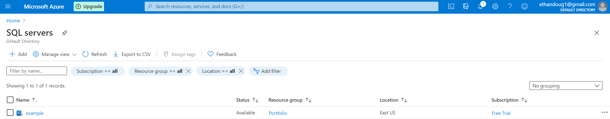
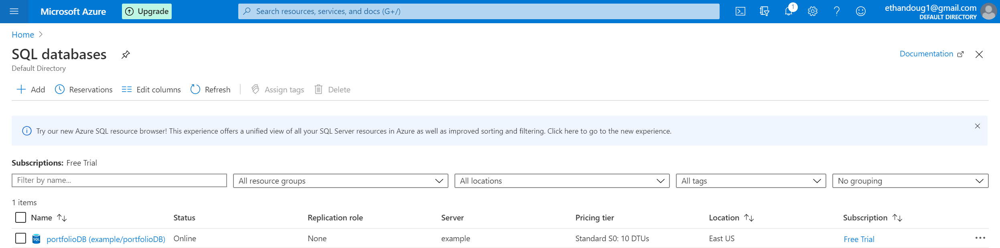

## Welcome to GitHub Pages

You can use the [editor on GitHub](https://github.com/ethandoug1/BI/edit/master/README.md) to maintain and preview the content for your website in Markdown files.

Whenever you commit to this repository, GitHub Pages will run [Jekyll](https://jekyllrb.com/) to rebuild the pages in your site, from the content in your Markdown files.

### Markdown

Markdown is a lightweight and easy-to-use syntax for styling your writing. It includes conventions for

```markdown
Syntax highlighted code block

# Header 1
## Header 2
### Header 3


- Bulleted
- List

1. Numbered
2. List

**Bold** and _Italic_ and `Code` text

[Link](url) and 
```

For more details see [GitHub Flavored Markdown](https://guides.github.com/features/mastering-markdown/).

### Jekyll Themes

Your Pages site will use the layout and styles from the Jekyll theme you have selected in your [repository settings](https://github.com/ethandoug1/BI/settings). The name of this theme is saved in the Jekyll `_config.yml` configuration file.

### Support or Contact

Having trouble with Pages? Check out our [documentation](https://help.github.com/categories/github-pages-basics/) or [contact support](https://github.com/contact) and we’ll help you sort it out.

# Introduction
The following data profile was done in SQL using sample data. The code has been recycled and adapted for this example.

# Environment
I created a server and established a database using Microsoft Azure. Sample sales data was used to create and populate the database.

## Server


## Database


# Code
```markdown
--DEALLOCATE TableCursor
--ALTER TABLE salesLt.ProductModel
--ALTER COLUMN CatalogDescription varchar(max);
CREATE PROCEDURE SampleProfile
AS
### Setup
SET NOCOUNT ON
SET ANSI_WARNINGS OFF -- Suppresses the "Null value is eliminated by an aggregate..." warning

DECLARE @TableName SYSNAME
DECLARE @TableType VARCHAR(15)
DECLARE @Schema SYSNAME
DECLARE @Catalog SYSNAME
DECLARE @ColumnName SYSNAME
DECLARE @OrdinalPosition INT
DECLARE @DataType SYSNAME
DECLARE @char INT
DECLARE @num TINYINT
DECLARE @date SMALLINT
DECLARE @sql VARCHAR(MAX)
DECLARE @stmtString VARCHAR(MAX)
DECLARE @stmtNum VARCHAR(MAX)
DECLARE @stmtDate VARCHAR(MAX)
DECLARE @stmtOther VARCHAR(MAX)
DECLARE @stmtUnsup VARCHAR(MAX)
DECLARE @q CHAR(1)   -- single quote
DECLARE @qq CHAR(2)  -- double quote

### Table variable to collect the final results
DECLARE @Results TABLE (
    [Schema] SYSNAME
  , [Catalog] SYSNAME
  , [Table Name] SYSNAME
  , [Table Type] VARCHAR(10)
  , [Column Name] SYSNAME
  , [Seq] INT
  , [Data Type] SYSNAME
  , [Avg Len/Val] NUMERIC
  , [Min Len/Val] NUMERIC
  , [Max Len/Val] NUMERIC
  , [Min Date] DATETIME
  , [Max Date] DATETIME
  , [Distinct Values] NUMERIC
  , [Num NULL] NUMERIC
  )

### quote char
SET @q = ''''
SET @qq = @q + @q

### The dynamic replacement strings for various data types
SET @stmtUnsup = 'null, null, null, null, null, null, 0'
SET @stmtString = 'avg(len([@@replace])), ' + 'min(len([@@replace])), ' + 'max(len([@@replace])), ' + 'null, null, count(distinct [@@replace]), ' + 'sum(case when [@@replace] is null then 1 else 0 end)'
SET @stmtNum = 'avg(CAST(isnull([@@replace], 0) AS FLOAT)), ' + 'min([@@replace]) AS [Min @@replace], ' + 'max([@@replace]) AS [Max @@replace], ' + 'null, null, count(distinct @@replace) AS [Dist Count @@replace], ' + 'sum(case when @@replace is null then 1 else 0 end) AS [Num Null @@replace]'
SET @stmtDate = 'null, null, null, min([@@replace]) AS [Min @@replace], ' + 'max([@@replace]) AS [Max @@replace], ' + 'count(distinct @@replace) AS [Dist Count @@replace], ' + 'sum(case when @@replace is null then 1 else 0 end) AS [Num Null @@replace]'
SET @stmtOther = 'null, null, null, null, null, count(distinct @@replace) AS [Dist Count @@replace], ' + 'sum(case when @@replace is null then 1 else 0 end) AS [Num Null @@replace]'

### The cursor to read through the schema.  Change the WHERE clause to control the tables/views used
DECLARE TableCursor CURSOR
FOR
SELECT 
    c.TABLE_SCHEMA
  , c.TABLE_CATALOG
  , c.TABLE_NAME
  , t.TABLE_TYPE
  , c.COLUMN_NAME
  , c.ORDINAL_POSITION
  , c.DATA_TYPE
  , c.CHARACTER_MAXIMUM_LENGTH
  , c.NUMERIC_PRECISION
  , c.DATETIME_PRECISION
FROM 
  INFORMATION_SCHEMA.COLUMNS c
INNER JOIN 
  INFORMATION_SCHEMA.TABLES t 
    ON 
          t.TABLE_SCHEMA = c.TABLE_SCHEMA
      AND t.TABLE_NAME = c.TABLE_NAME
WHERE 
          c.TABLE_SCHEMA IN ('SalesLT')
      AND t.TABLE_TYPE NOT IN ('VIEW')
ORDER BY 
          c.TABLE_NAME
        , c.ORDINAL_POSITION


OPEN TableCursor

FETCH NEXT
FROM TableCursor
INTO @Schema
   , @Catalog
   , @TableName
   , @TableType
   , @ColumnName
   , @OrdinalPosition
   , @DataType
   , @char
   , @num
   , @date

### Process through the database schema
WHILE @@FETCH_STATUS = 0
BEGIN
  SET @sql =
  CASE 
      WHEN @DataType = 'image'
        THEN @stmtUnsup
      WHEN @DataType = 'text'
        THEN @stmtUnsup
      WHEN @DataType = 'ntext'
        THEN @stmtUnsup
      WHEN @char IS NOT NULL
        THEN @stmtString
      WHEN @num IS NOT NULL
        THEN @stmtNum
      WHEN @date IS NOT NULL
        THEN @stmtDate
      ELSE @stmtOther
  END
  SET @sql = REPLACE(@sql, '@@replace', @ColumnName)

  IF @sql <> ''
  BEGIN
    SET @Schema = @q + @Schema + @q
    SET @Catalog = @q + @Catalog + @q
    SET @TableName = @q + @TableName + @q
    SET @TableType = @q + @TableType + @q
    SET @ColumnName = @q + REPLACE(@ColumnName, @q, @qq) + @q
    SET @DataType = @q + @DataType + @q
   
    SET @sql = 'SELECT ' + @Schema + ', ' + @Catalog + ', ' + @TableName + ', ' + @TableType + ', ' + @ColumnName + ', ' + CONVERT(VARCHAR(5), @OrdinalPosition) + ', ' + @DataType + ', ' + @sql + ' FROM ' + Concat(REPLACE(@schema, '''', ''),'.', REPLACE(@TableName, '''', '')) + ''

    PRINT @sql

    INSERT INTO @Results
    EXECUTE (@sql)
  END

  FETCH NEXT
  FROM TableCursor
  INTO @Schema
     , @Catalog
     , @TableName
     , @TableType
     , @ColumnName
     , @OrdinalPosition
     , @DataType
     , @char
     , @num
     , @date
END

### Clean-up
CLOSE TableCursor

DEALLOCATE TableCursor

### Display the results
SELECT 
    [Schema]
  , [Catalog]
  , [Table Name]
  , CASE [Table Type]
      WHEN 'BASE TABLE'
        THEN 'TABLE'
      ELSE [Table Type]
      END AS 'Table Type'
  , [Column Name]
  , [Seq]
  , [Data Type]
  , [Avg Len/Val]
  , [Min Len/Val]
  , [Max Len/Val]
  , [Min Date]
  , [Max Date]
  , [Distinct Values]
  , [Num NULL]
FROM 
    @Results
ORDER BY 
    [Table Name]
  , [Seq]
  , [Column Name]

### Reset
SET NOCOUNT OFF
SET ANSI_WARNINGS ON

### Stored Procedure
exec SampleProfile
